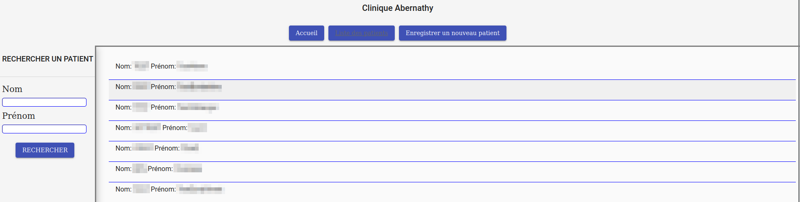

<a name="readme-top"></a>

<!-- PROJECT LOGO -->
<br />
<div align="center">
  <a href="https://github.com/BenCorpro/abernathy">
    
  </a>

  <h3 align="center">Abernathy Clinic</h3>

  <p align="center">
    An application to help physicians identify patients most at risk for diabetes 
    <br />
    Designed for Abernathy Clinic
  </p>
</div>


<!-- TABLE OF CONTENTS -->
<details>
  <summary>Table of Contents</summary>
  <ol>
    <li>
      <a href="#about-the-project">About The Project</a>
      <ul>
        <li><a href="#built-with">Built With</a></li>
      </ul>
    </li>
    <li>
      <a href="#getting-started">Getting Started</a>
      <ul>
        <li><a href="#prerequisites">Prerequisites</a></li>
        <li><a href="#installation">Installation</a></li>
      </ul>
    </li>
    <li><a href="#usage">Usage</a></li>
    <li><a href="#test-reports">Test Reports</a></li>
  </ol>
</details>


<!-- ABOUT THE PROJECT -->
## About The Project

<div align="center">
<br />
    
<br />
</div>

This is the 9th and final project for the Openclassrooms Java developper's course<br />
The application must be build with a microservices architecture, runnable in Docker containers, with both MySQL and MongoDB as databases

<p align="right">(<a href="#readme-top">back to top</a>)</p>


### Built With

* Java 17
* Spring Boot
* Angular
* MySQL
* MongoDB

<p align="right">(<a href="#readme-top">back to top</a>)</p>


<!-- GETTING STARTED -->
## Getting Started

<p>
These instructions will help you start the application on your machine.<br />
Running it on Docker is the easiest way considering the number of dependencies needed
</p>

### Prerequisites

* Install Java 17
* Install Maven
* Install Docker an Docker Compose

### Installation

1. Clone the repo or download it
   ```sh
   git clone https://github.com/BenCorpro/abernathy
   ```
2. Compile and package each of 3 microservices (patientinfo, patienthistory, riskreport) 
   ```sh
   mvn package
   ```
3. Execute the docker-compose.yml at project root
   ```sh
   docker-compose -d up
   ```
4. Go to home page
   ```js
   http://localhost:80/
   ```
<p align="right">(<a href="#readme-top">back to top</a>)</p>


<!-- USAGE EXAMPLES -->
## Usage

The application can be used as a whole with the user interface at <a href="http://localhost:80/">localhost:80</a> or as 3 separated APIs.

_For this last usage, please refer to the API Documentation in documentation directory_

<p align="right">(<a href="#readme-top">back to top</a>)</p>


<!-- TEST REPORTS -->
## Test Reports

_Test and code coverage reports are available for all 3 services as a site in documentation directory_

<p align="right">(<a href="#readme-top">back to top</a>)</p>